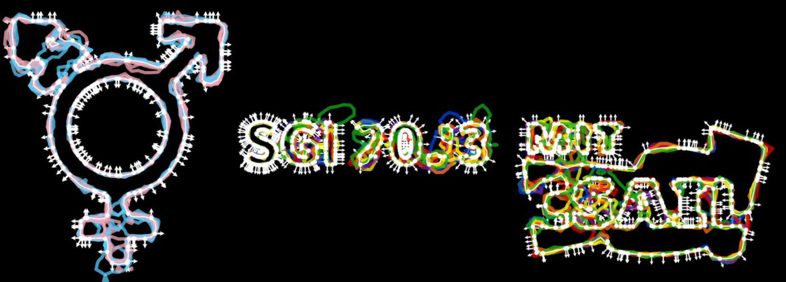

# Sampling Surfaces from Point Clouds




Reconstructing a complete surface from a discrete point cloud is a fundamentally underdetermined problem: there are infinitely many continuous surfaces that pass through any given finite set of points. Discriminating between all these possibilities requires encoding some prior information about the surface (e.g., smoothness, or similarity to existing data). For a given point cloud, this prior will produce a posterior distribution in the space of possible surfaces, letting us identify some surfaces as "likelier" than others. We will explore different methods for encoding these priors and sampling from this space of possible surfaces.


---

## Requirements

:warning: Warning: This installation was only tested on `Linux` 

Gaussian Process:

1. `pip`

Neural Process:

1. `Docker`
2. NVIDIA Driver
3. NVIDIA Docker

To build environment:

```
docker build -t samp-surfs docker/ 
```

To run jupyter lab kernel:

```
docker run --runtime=nvidia --gpus all -p 8888:8888 -it --rm --volume /:/host --workdir /host$PWD samp-surfs

```

---

## Jupyter Notebooks

1. [Gaussian Process](gaussian_process.ipynb)
2. [Neural Process](neural_process.ipynb)
3. [Neural Process with PointCloudMNIST Dataset](neural_process_mnist.ipynb)
4. [Attentive Neural Process (Rectangles)](attentive_neural_process.ipynb)


